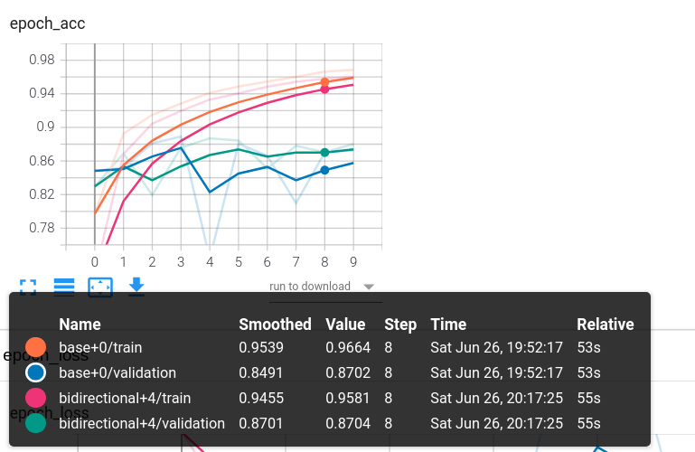
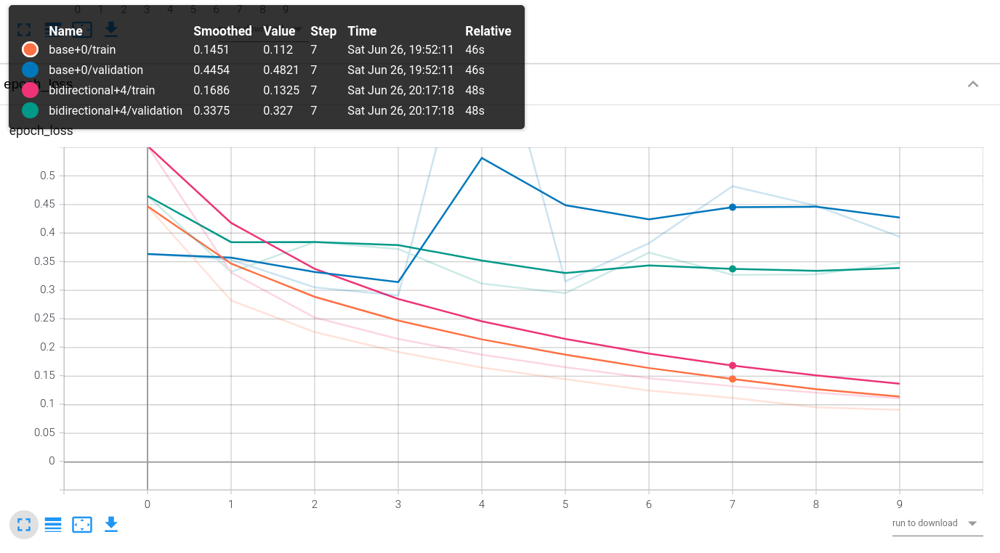
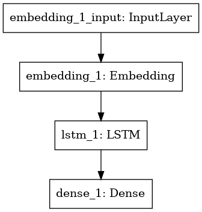
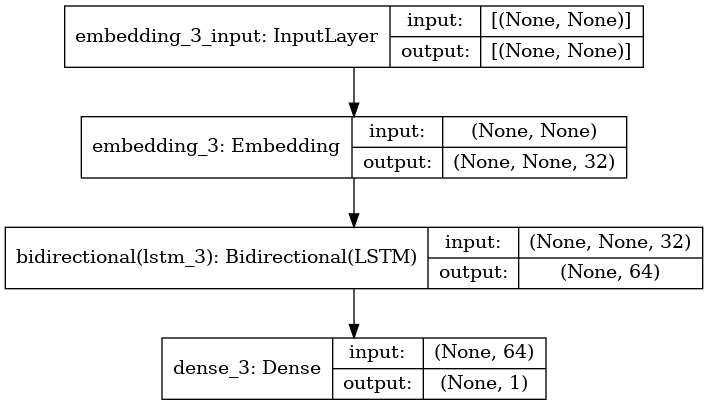

# Sentiment Analysis using BiDirectional-LSTM
- [Loss Curves](/README.md#Loss-Curves)
- [Accuracy Curves](/README.md#Accuracy-Curves)
- [Base LSTM Model Structure](/README.md#Structures)
- [BiDirectional LSTM Structure](/README.md#Structures)

## Intuition & Introduction
First lets train the model on chronological sequence - ```The food is good``` and then on ```good is food The``` While doing sentiment analysis. Sentiment Analysis is nothing just knowing if the sentence is more of positive or negative, Goal is to figure out the product or the restaurant is good or not.

LSTM - long short term memory = A varient of RNN (Recurrent Neural Networks) that remove the vanishing gradient problems. LSTM is having a carry input that works as a conveyor running in parallel with the model to add the first word of sentence till the last word without losing it. Yes RNN due to vanishing gradient forget what the first word was till the end of setence. If the sentence is BIG - forget then to get good results with RNN.

## Accuracy Curves
(Bidirectional LSTM winning on Validation Data with more accuracy)


## Loss Curves
(Bidirectional LSTM less loss on Validation Data than base version)


# Structures
## A BaseLine model for forward and backward sequence test


## Bidirectional to combine both forward and backward sequence texts


LSTM is heavy and slow, GRU is a cheaper version doing the almost same work using less resources. But yes accuracy also less comparatively to LSTM.

